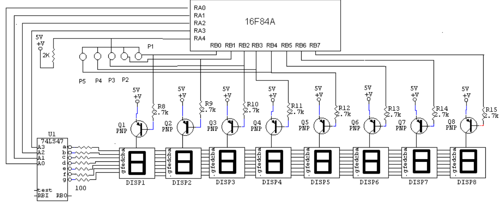

Reloj de ajedrez basado en el popular microcontrolador `PIC16F84`, que hicimos entre un amigo y yo durante varios años. Pero en el 2010 fué cuando empezó a agarrar forma. Con este proyecto es que aprendí a programar PIC's, y lo hice en assembler 🤮

---

Inspirado principalmente por este proyecto http://www.ufps.edu.co/materias/ucontrol/htdocs/pdf/tempor.pdf

Recuerdo nos guiamos mucho en la lógica descrita (modalidad fisher) pero sobretodo en el diagrama electrónico.

Creo que nunca cambiamos nada del diagrama original:

Sin embargo, nunca logramos poner a funcionar el código que venía con ese proyecto, entonces me tocó programarlo, y pues como yo ni sabia que se podia programar en C, lo hice en assembler porque así está en ese proyecto 🤷

---

Tambien nos guiamos de este otro proyecto para crear la PCB y otros detalles de implementacion: https://juancolonna.blogspot.com/2008/03/reloj-relos-de-ajedrez-con-pic-16f84.html

Lamentablemente he perdido los planos del PCB, y el `.hex` ya compilado

---

El archivo assembler lo programé con el MPLab de Microchip